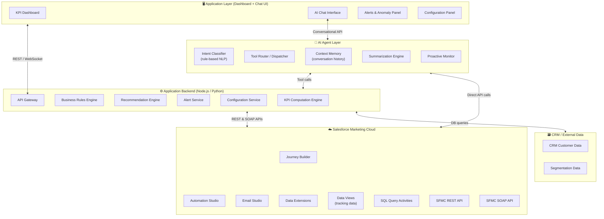
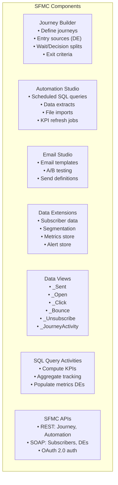
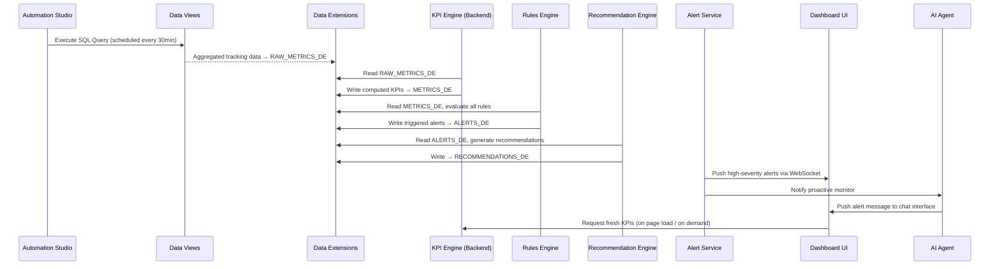

# Marketing Decision Support Application — SFMC Architecture

> **Scope**: PFE-level implementation · Rule-based logic · API-based AI Agent  
> **Target Users**: Marketing Consultants  
> **Core Platform**: Salesforce Marketing Cloud (SFMC)

---

## 1. High-Level System Architecture



---

## 2. Layer-by-Layer Architecture

### Layer 1 — Data Collection

**Role**: Pull raw marketing data from SFMC into the application.

| Source | Method | Data Collected |
|---|---|---|
| **Data Views** | SQL Queries via Automation Studio | Email sends, opens, clicks, bounces, unsubscribes |
| **Journey Builder API** | `GET /interaction/v1/interactions` | Journey definitions, entry/exit counts, step status |
| **Data Extensions** | SFMC REST API + SOAP API | Subscriber lists, segmentation filters, custom attributes |
| **SFMC Tracking Extract** | Automation Studio + FTP extract | Bulk historical tracking data |
| **CRM API** | REST calls to CRM | Customer profiles, purchase history, lifecycle stage |

**Polling Strategy**:
- Near-real-time: every 15–30 minutes via scheduled Automation Studio runs
- On-demand: triggered by user query via agent or dashboard

---

### Layer 2 — Data Processing (KPI Engine)

Raw data is transformed into actionable KPIs stored back in a **Metrics Data Extension**.

```
KPI Computation Engine
│
├── Open Rate         = Opens / Unique Sends × 100
├── Click Rate        = Clicks / Unique Opens × 100
├── Conversion Rate   = Conversions / Unique Clicks × 100
├── Drop-off Rate     = (Entries - Exits) / Entries × 100  [per step]
├── Unsubscribe Rate  = Unsubscribes / Unique Sends × 100
└── Engagement Score  = weighted(OR × 0.4 + CTR × 0.4 + CVR × 0.2)
```

**Storage**: Computed KPIs are written to a dedicated `METRICS_DE` Data Extension with timestamps, enabling trend analysis over time.

---

### Layer 3 — Business Rules Engine

A stateless, rule-based evaluation engine that reads from `METRICS_DE` and emits alerts or triggers recommendations.

```
Rules Engine — Evaluation Loop (runs every N minutes)
│
├── RULE-01: IF engagement_score < 0.30                → ALERT [HIGH]   "Low engagement"
├── RULE-02: IF drop_off_rate[step] > 60%              → ALERT [MEDIUM] "High step drop-off"
├── RULE-03: IF unsubscribe_rate > 1.5%                → ALERT [HIGH]   "Unsubscribe spike"
├── RULE-04: IF click_rate Δ < -30% vs prev. week      → ALERT [MEDIUM] "Click decline"
├── RULE-05: IF conversion_rate < baseline × 0.7       → ALERT [HIGH]   "Conversion drop"
├── RULE-06: IF open_rate < 10% for 3+ consecutive runs → ALERT [LOW]   "Chronic low opens"
└── RULE-07: IF journey_entries = 0 for 24h            → ALERT [LOW]    "Journey inactive"
```

Each alert includes: `journey_id`, `metric_name`, `current_value`, `threshold`, `severity`, `timestamp`.

---

### Layer 4 — Recommendation Engine

Triggered by the Rules Engine. Maps each alert type to a set of concrete SFMC actions.

| Alert Type | Recommendation Category | Suggested Actions |
|---|---|---|
| Low engagement | Content / Timing | A/B test subject lines · adjust send time · review audience |
| High drop-off at step | Journey optimization | Inspect wait duration · shorten path · add re-engagement branch |
| Unsubscribe spike | Frequency management | Reduce cadence · add opt-down preference center |
| Conversion drop | Segmentation / Content | Narrow audience · personalize offer · adjust CTA |
| Chronic low opens | List hygiene | Remove inactive subscribers · re-permission campaign |
| Journey inactive | Operational | Check entry criteria · verify data sources |

Recommendations are stored in a `RECOMMENDATIONS_DE` and surfaced in the dashboard and AI chat.

---

### Layer 5 — Alerting System

| Component | Description |
|---|---|
| **Alert Service** | Evaluates rules, persists alerts to `ALERTS_DE` |
| **Real-time Push** | WebSocket or Server-Sent Events (SSE) to the dashboard UI |
| **Proactive Agent Notification** | AI Agent proactively pushes alerts into the chat interface |
| **Severity Levels** | 🔴 HIGH · 🟡 MEDIUM · 🟢 LOW |
| **Alert Payload** | Journey name, affected metric, value, trend direction, root cause, link to recommendation |

---

### Layer 6 — Configuration & Control Layer

Consultants can act on SFMC directly from the dashboard:

| Action | SFMC API Used |
|---|---|
| View active journeys | `GET /interaction/v1/interactions` |
| Pause / activate journey | `POST /interaction/v1/interactions/{id}/stop` |
| Modify entry criteria / filter | SOAP API — `FilterDefinition` object |
| Adjust scheduling | Automation Studio REST API |
| Update Data Extension records | REST API — `DataExtensionObject` |

---

## 3. AI Agent Architecture (Layer 7)

```mermaid
graph LR
    USER["👤 Consultant\n(chat input)"]

    subgraph AGENT_CORE["AI Agent Core"]
        direction TB
        NLP["1. Intent Classifier\n(keyword + pattern matching)"]
        CTX["2. Context Memory\n(session store, last 20 turns)"]
        PLANNER["3. Action Planner\n(maps intent → tool)"]
        EXECUTOR["4. Tool Executor"]
        RESP["5. Response Builder\n(template + data)"]
    end

    subgraph TOOLS["Agent Tools (API Wrappers)"]
        T1["get_journey_kpis(journey_id)"]
        T2["get_alerts(severity?)"]
        T3["get_recommendations(journey_id)"]
        T4["pause_journey(journey_id)"]
        T5["activate_journey(journey_id)"]
        T6["search_subscribers(filters)"]
        T7["get_campaign_summary(campaign_id)"]
        T8["update_scheduling(automation_id, schedule)"]
        T9["get_segment_stats(segment_id)"]
        T10["summarize_account()"]
    end

    USER -->|natural language| NLP
    NLP --> CTX
    CTX --> PLANNER
    PLANNER --> EXECUTOR
    EXECUTOR --> TOOLS
    TOOLS -->|JSON response| RESP
    RESP -->|formatted reply| USER
```



### 3.1 Intent Classification (Rule-based NLP)

No ML model required. A structured intent map using keyword patterns:

| Intent | Trigger Keywords | Tool Called |
|---|---|---|
| `QUERY_KPI` | "open rate", "click rate", "performance", "how is journey" | `get_journey_kpis` |
| `QUERY_ALERTS` | "alerts", "issues", "anomalies", "problems" | `get_alerts` |
| `QUERY_RECOMMENDATIONS` | "suggest", "optimize", "what should I do", "improve" | `get_recommendations` |
| `PAUSE_JOURNEY` | "pause", "stop journey", "deactivate" | `pause_journey` |
| `ACTIVATE_JOURNEY` | "activate", "start journey", "resume" | `activate_journey` |
| `SEARCH_SUBSCRIBERS` | "find customers", "segment", "subscribers who" | `search_subscribers` |
| `SUMMARIZE` | "summary", "report", "overview", "recap" | `summarize_account` / `get_campaign_summary` |
| `SCHEDULE_UPDATE` | "reschedule", "change send time", "update schedule" | `update_scheduling` |
| `SEGMENT_STATS` | "segment health", "audience size", "segment performance" | `get_segment_stats` |

Fallback: if no intent is matched → prompt user to rephrase, suggest closest matching command.

### 3.2 Context Memory

```
Session Store (in-memory / Redis)
│
├── conversation_id     : UUID
├── turns[]             : [{user_msg, agent_reply, intent, entities, timestamp}]
├── active_journey_id   : last discussed journey
├── active_segment_id   : last discussed segment
├── active_campaign_id  : last discussed campaign
└── last_metric         : last KPI type discussed
```

The context store enables follow-up questions:
- "What's the open rate for that journey?" (no need to re-specify journey)
- "Now pause it" (resolves `it` from `active_journey_id`)

Memory TTL: session-scoped (cleared after 30 minutes of inactivity).

### 3.3 Proactive Monitoring (Agent Push)

The Proactive Monitor runs as a background process:
1. Polls `ALERTS_DE` every 15 minutes
2. Filters alerts with `severity = HIGH` and `notified = false`
3. Formats and pushes a notification into the active chat session
4. Marks alert as `notified = true`

Example push message:
> ⚠️ **Proactive Alert** — Journey *"Welcome Series Q2"* has an unsubscribe rate of **2.3%**, exceeding your 1.5% threshold. Would you like to see the root cause analysis or get optimization recommendations?

---

## 4. SFMC Components Breakdown



### Data Extensions Schema

#### `METRICS_DE`
| Field | Type | Description |
|---|---|---|
| `MetricID` | Text (PK) | UUID |
| `JourneyID` | Text | Journey reference |
| `JourneyName` | Text | |
| `StepName` | Text | Journey step for drop-off |
| `OpenRate` | Decimal | % |
| `ClickRate` | Decimal | % |
| `ConversionRate` | Decimal | % |
| `DropOffRate` | Decimal | % |
| `UnsubscribeRate` | Decimal | % |
| `EngagementScore` | Decimal | 0–1 weighted score |
| `ComputedAt` | Date | Timestamp |

#### `ALERTS_DE`
| Field | Type | Description |
|---|---|---|
| `AlertID` | Text (PK) | UUID |
| `JourneyID` | Text | |
| `RuleCode` | Text | e.g., `RULE-03` |
| `Severity` | Text | HIGH / MEDIUM / LOW |
| `MetricName` | Text | |
| `CurrentValue` | Decimal | |
| `Threshold` | Decimal | |
| `RootCause` | Text (long) | Human-readable explanation |
| `Notified` | Boolean | Whether pushed to chat |
| `CreatedAt` | Date | |

#### `RECOMMENDATIONS_DE`
| Field | Type | Description |
|---|---|---|
| `RecID` | Text (PK) | |
| `AlertID` | Text (FK) | Links to alert |
| `Category` | Text | Content / Frequency / Segmentation |
| `Title` | Text (short) | Action title |
| `Description` | Text | Full recommendation text |
| `SFMCAction` | Text | Suggested SFMC component to use |
| `CreatedAt` | Date | |

---

## 5. Data Flow Architecture



---

## 6. End-to-End Workflow Scenarios

---

### Scenario A — Low Engagement Journey Detection

**Trigger**: Scheduled Automation Studio job runs at 09:00.

```
09:00 → Automation Studio executes SQL on _Open, _Click, _Sent Data Views
09:02 → Results written to RAW_METRICS_DE
09:03 → KPI Engine reads raw data, computes:
         Open Rate = 8.2%, Click Rate = 1.1%, Engagement Score = 0.21
09:04 → Rules Engine evaluates RULE-01: 0.21 < 0.30 threshold → TRIGGERED
         Severity: HIGH | Journey: "Re-engagement Q2"
09:04 → Alert written to ALERTS_DE with root cause:
         "Open rate (8.2%) is critically below the 15% benchmark,
          suggesting messaging fatigue or targeting mismatch."
09:05 → Recommendation Engine generates:
         - "Test a new subject line with personalization tokens"
         - "Narrow segment to last-30-day active contacts"
         - "Add a wait period before next send"
09:05 → Alert Service pushes HIGH alert to Dashboard via WebSocket
09:05 → Dashboard KPI card flashes red for "Re-engagement Q2"
09:06 → Proactive Monitor pushes alert to AI Chat interface:
         "⚠️ Journey 'Re-engagement Q2' has low engagement (score: 0.21).
          Want to see recommendations or pause the journey?"
09:07 → Consultant: "Show me the recommendations"
09:07 → Agent calls get_recommendations(journey_id="RE-Q2-001")
09:08 → Agent returns formatted list of 3 recommendations
09:09 → Consultant: "Pause it for now"
09:09 → Agent calls pause_journey(journey_id="RE-Q2-001")
09:09 → SFMC API confirms journey paused
09:09 → Agent: "✅ Journey 'Re-engagement Q2' has been paused successfully."
```

---

### Scenario B — AI Chatbot Query Example

**Consultant query**: *"Which journeys had a drop-off rate above 50% last week?"*

```
Input   → "Which journeys had a drop-off rate above 50% last week?"
│
├── Intent Classification
│   → Keywords: "drop-off rate", "above 50%", "last week"
│   → Intent: QUERY_KPI (sub-type: threshold filter + time range)
│
├── Entity Extraction
│   → metric: drop_off_rate
│   → operator: > 50%
│   → time_range: last 7 days
│
├── Tool Call
│   → get_journey_kpis(metric="drop_off_rate", operator="gt", value=50,
│                      date_from="2026-04-13", date_to="2026-04-20")
│
├── Data Retrieval
│   → Query METRICS_DE WHERE DropOffRate > 50 AND ComputedAt >= last 7 days
│   → Returns 3 journeys:
│      - "Welcome Series"       → 67% drop-off at Step 2
│      - "Win-back Campaign"    → 58% drop-off at Step 1
│      - "Product Launch Flow"  → 52% drop-off at Step 4
│
└── Response Building
    → "Here are the journeys with drop-off rates above 50% over the past 7 days:
       
       📉 **Welcome Series** — 67% drop-off at Step 2 (Email: Day-3 Follow-up)
       📉 **Win-back Campaign** — 58% drop-off at Step 1 (Entry filter)
       📉 **Product Launch Flow** — 52% drop-off at Step 4 (Conversion page)
       
       Would you like optimization recommendations for any of these?"

Follow-up → "Yes, for the welcome series"
Context   → active_journey_id resolved from previous turn = "Welcome Series"
Tool Call → get_recommendations(journey_id="welcome-series-001")
Response  → 3 targeted recommendations displayed
```

---

### Scenario C — Proactive Alert Scenario

**Trigger**: Unsubscribe rate spike detected mid-campaign.

```
14:30 → Scheduled rules evaluation runs
        Unsubscribe Rate for "Promo Flash May" = 2.8%
        RULE-03 triggered: 2.8% > 1.5% threshold
        Severity: HIGH

14:31 → Alert created in ALERTS_DE:
        RootCause: "Unsubscribe rate (2.8%) is nearly double the 1.5% safety
                    threshold. This may indicate over-frequency, irrelevant content,
                    or poor list quality entering this journey."

14:31 → Recommendation generated:
        Category: Frequency Management
        → "Immediately reduce send cadence (daily → every 3 days)"
        → "Insert preference center link in next email"
        → "Exclude subscribers who opened < 1 email in last 90 days"

14:32 → Dashboard: RED badge on "Promo Flash May" journey card

14:32 → AI Agent pushes proactive notification to chat:
        "🚨 Proactive Alert — Journey 'Promo Flash May' is experiencing
         an unsubscribe spike (2.8%). This is a HIGH severity issue.
         
         Root cause: Over-frequency or low relevance signal.
         
         Recommended actions:
         ① Reduce send frequency
         ② Add preference center
         ③ Narrow segment to engaged contacts
         
         Shall I apply the frequency adjustment or pause the journey?"

14:33 → Consultant: "Reduce frequency, then send me a summary"

14:33 → Agent: update_scheduling(automation_id="promo-flash-may",
                                   new_cadence="every_3_days")
14:34 → Agent: get_campaign_summary(campaign_id="promo-flash-may")
14:34 → Agent returns structured summary:
        "📋 Campaign Summary — Promo Flash May
         Status: Active (cadence updated to every 3 days)
         Total Entries: 42,300
         Open Rate: 18.4% | Click Rate: 3.1% | Unsubscribe Rate: 2.8% ⚠️
         Active Segment: All contacts — last purchase < 90 days
         Recommendation applied: Frequency reduced ✅"
```

---

## 7. Technology Stack Recommendation (PFE-Level)

| Component | Technology |
|---|---|
| **Frontend (Dashboard + Chat)** | React.js + Chart.js / Recharts |
| **Backend API** | Node.js (Express) or Python (FastAPI) |
| **Agent NLP** | Rule-based pattern matching (no external LLM required) |
| **Agent LLM (optional upgrade)** | OpenAI API / Google Gemini API (via simple REST calls) |
| **Session / Context Store** | In-memory Map (dev) or Redis (production) |
| **Real-time Push** | WebSockets (Socket.IO) or Server-Sent Events |
| **SFMC Auth** | OAuth 2.0 Client Credentials (existing pattern from your extension) |
| **SFMC Data** | REST API + SOAP API (as in your current Chrome extension) |
| **Metrics Storage** | SFMC Data Extensions (native, no external DB needed) |
| **Deployment** | Node.js server + SFMC Installed Package (or standalone web app) |

> [!NOTE]
> The optional LLM upgrade (OpenAI / Gemini) replaces the rule-based Intent Classifier with a true language model, enabling more flexible queries. All tools and the rest of the architecture remain identical — the LLM simply selects which tool to call based on the conversation. This requires only a single additional API call per user message.

---

## 8. Security Considerations

| Concern | Mitigation |
|---|---|
| SFMC credentials | OAuth 2.0 Client Credentials, stored server-side only (never in browser) |
| API access control | Backend validates all agent tool calls, restricts destructive actions (pause, delete) to authenticated users |
| Agent action authorization | All journey modifications require explicit user confirmation before execution |
| Data Extensions | Read/write access scoped to specific DEs via SFMC Installed Package permissions |
| Context memory | Session data never persisted to disk; TTL-based expiry |

---

## 9. Summary Architecture Map

```
┌─────────────────────────────────────────────────────────────────┐
│                    APPLICATION LAYER (UI)                        │
│   KPI Dashboard │ Alert Panel │ Config Panel │ AI Chat Interface │
└────────────────────────┬────────────────────────────────────────┘
                         │ REST / WebSocket
┌────────────────────────▼────────────────────────────────────────┐
│                    AI AGENT LAYER                                │
│  Intent Classifier → Action Planner → Tool Executor             │
│  Context Memory (session) │ Proactive Monitor                   │
│  Tool Set: get_kpis · pause_journey · search_subscribers · etc. │
└────────────────────────┬────────────────────────────────────────┘
                         │ REST API calls
┌────────────────────────▼────────────────────────────────────────┐
│                    BACKEND APPLICATION LAYER                     │
│  KPI Engine │ Rules Engine │ Recommendation Engine │ Alert Svc  │
└────────────────────────┬────────────────────────────────────────┘
                         │ SFMC REST + SOAP APIs
┌────────────────────────▼────────────────────────────────────────┐
│                    SALESFORCE MARKETING CLOUD                    │
│  Journey Builder │ Automation Studio │ Email Studio             │
│  Data Views (_Sent, _Open, _Click) │ Data Extensions           │
│  SQL Query Activities │ REST + SOAP APIs                        │
└─────────────────────────────────────────────────────────────────┘
                         │
┌────────────────────────▼────────────────────────────────────────┐
│                    CRM / EXTERNAL DATA                           │
│  Customer Profiles │ Purchase History │ Segmentation Data       │
└─────────────────────────────────────────────────────────────────┘
```
